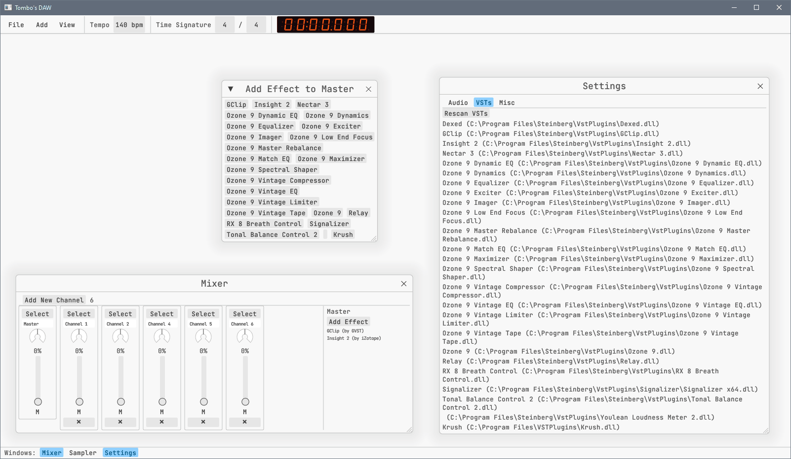
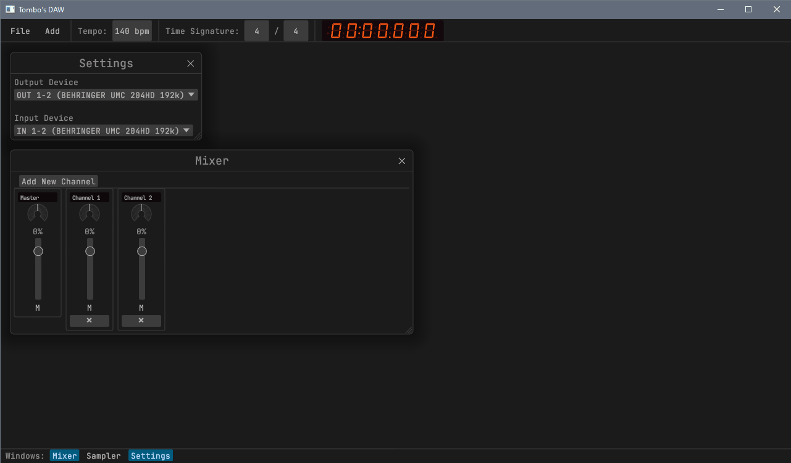

# Development Progress

## 2023-02-23 - VST Effects in the Mixer



In order to start using VSTs and processing sound through them, I thought it
would be useful to add all the GUI elements in order to load VSTs from file,
associate them with specific channels, and display them accordingly.

Firstly, I separated the Settings screen into multiple tabs. The first tab shows
audio input/output settings as it always has (see 2023-02-11's screenshot for
reference), the "VSTs" tab shows a "Rescan VSTs" button which will loop through
known directories to contain VST plugins, and a list of plugins which loaded
successfully (which means it's a 64-bit plugin, first and foremost, and didn't
have any startup issues, which is also a possibility). Right now it's very
basic, showing only the plugin name and their path, but I would like to create a
more formal UI which allows you to enable and disable individual plugins'
visibility elsewhere across the application (ie. in the "Add Effect" window,
which we'll get to later).

Second, a "Select" button has been added to the top of each mixer Channel. Once
a channel is selected a side panel is shown, which lists all the effects added
to that channel. It can be added to with an "Add Effects" button, which'll pop
open another window with a list of effects. When any button is selected, the
window closes, the VST is loaded into memory, and is displayed in the side
panel.

Do note that in the list of VSTs on the right, "Dexed" appears, which is a
`Synth` VST, whereas it does not appear in the new window. That's because
"synths" will eventually be routed through mixer channels _before_ the effects
chain - this is similar to FL Studio, where any instrument can be associated
with any channel. I'm not sure if I want to allow multiple instruments to be
associated with the same mixer channel yet, depending on the data structure, and
how the audio processing will end up working.

The basic functionality is down, and in the future the GUI will be cleaned up
dramatically. For example, selecting a channel should just require you to click
the channel, rather than a specific "Select" button. There should be a more
obvious way to highlight the fact that it's selected, either with a different
coloured border, or another indication. However, that's all going to happen
further down the line. I am victim to polish UI too soon, and am trying to learn
from my mistakes!

## 2023-02-18 - GUI Events and State Restructure

As previously mentioned below, I have implemented a `UIEvent` queue, which
allows the front end to amass all potential changes and write to the state once
at the end of every cycle, if even necessary. This _vastly_ reduces the number
of writes to the main project state, and allows for a much more performant audio
engine (proof withstanding!). This was also achieved using `RwLock` instead of
`Mutex`, so that the UI and audio engine can both _read_ from the project state
at the same time, vastly reducing the number of potential lock collisions
between threads. Huzzah!

Rather than use white noise as a method of sound generation, I opted for a sine
wave, which will allow me to better understand the sample data structure a
little better. Currently, I've hacked together the master channel as a way to
control the sine wave, using the volume as volume, and the left/right panning
knob for pitch.

Despite a lot of code changing internally, there'll still be no screenshots
today as the UI has not changed a bit! However, now that the "hard work" is "out
of the way" (meaning there's still a tonne of even more difficult work to
complete), I expect new visual features to start cropping up left, right, and
center!

## 2023-02-16 - Ring Buffers and UI Events

Boy oh boy am I in for a treat. Yes, the system "works" using the method I
described below. I think it could definitely generate some sound from the mixer
channels if I implemented it, too (it just generates random noise for the time
being). **However**, because the shared system state is using a `Mutex`, which
means whatever has access to it keeps control until it's done, the GUI has
control over this more frequently than not, when actively using the application.
As such, it frequently runs into buffer underruns, and the random noise becomes
quite glitchy (I think it's chunks of noise repeating over until a new chunk is
generated).

Therefore, I believe my next plan of action is to implement a GUI event system,
much like the existing `AudioEngineEvent` for re-initialising the engine
whenever an output device is changed. This means every UI element needs to be
accounted for, and will not change the system state unless it's part of a much
larger enum. You could consider this the flux (or redux) pattern. I'm hoping
that this will allow both the UI and Audio to have concurrent read-only access,
and have the state update only when it needs to.

## 2023-02-14 - Audio Streams

I've successfully opened an audio stream! The first test was to output white
noise, as that can be done with a single line of code (and silence isn't a good
test because how do you know it's truly working?!).

I've also completely restructured the application so that system state is
completely detached from windows themselves, therefore making it more of a truly
global state where any window can perform any system task. I can't remember why
exactly this was necessary, but it'll be a lot more useful once I have a proper
audio engine set up.

### Audio Engine

The way I imagine it'll look is as follows. There are three threads: GUI, Audio
Engine, and Audio Output, and one data source: System State.

```
 -------      =========     ----------------     ----------------
 | GUI | <--> | State | --> | Audio Engine | --> | Audio Output |
 -------      =========     ----------------     ----------------
```

GUI needs to have mutable access to the State, whereas the Audio Engine purely
reads from it to generate samples to send to the Audio Output.

All three threads run independently from each other - GUI is approximately 60
times per second, where the Audio Engine could be anywhere up to 1000-2000,
depending on the output settings (eg. sample rate, buffer size).

In any given cycle of the audio engine, it loops through each of the mixer
channels, generates its initial input, runs that input through each effect to
the channel, and they all get muxed at the end into the master channel. Whatever
finds it way through to the end of this process gets sent to the Output thread,
where CPAL handles the output.

This raises a couple of questions:

* Can mixer channels be processed concurrently? Seems like a good opportunity to
  avoid buffer underruns.

* If channels are processed concurrently, how would channel routing/buses work?
  (Where output from one channel can be sent as an input to another channel)

I shan't focus on these yet as I can't optimise something that doesn't exist!

Multi-threading always feels like a daunting task, and it's something I've never
truly mastered, so this is a good opportunity to git gud. I know I'll need and
Arc and a Mutex at some point, I'm sure, but it's time to figure out why and
how!

## 2023-02-11 - GUI Polish (Already?!)



Today, I worked on cleaning up the UI a little - mostly non visual, although I
did include [egui_extras_xt](https://github.com/xTibor/egui_extras_xt) for the
fancy knobs and song position readout at the top. I also added a second window
to display available inputs and outputs using CPAL. Currently it just converts
them all to strings, and you can change the String value - no audio devices are
actually switched or connected to yet!

Tomorrow, I'm going to learn how to open audio streams and switch between them
using the Settings window.

## 2023-02-10 - Basic GUI Set Up!


Set up a project with egui and followed several examples to create a basic
windowing system with a mixer view. The mixer view contains audio channels with
their name, volume, panning, and mute status, all of which are editable.

Currently, the mixer channels' state are completely separate from the Project,
as they are stored in a Box inside the Windows struct. I still don't know what
the project's state management should look like. Really, I should be focusing on
making some noises rather than the GUI!

Next time:
* Generate audio of some kind, running alongside the GUI
  * Explore the possibility of using ASIO for low latency audio
* Pay closer attention to the data structures required to store a music project,
  including all its MIDI and audio data.
