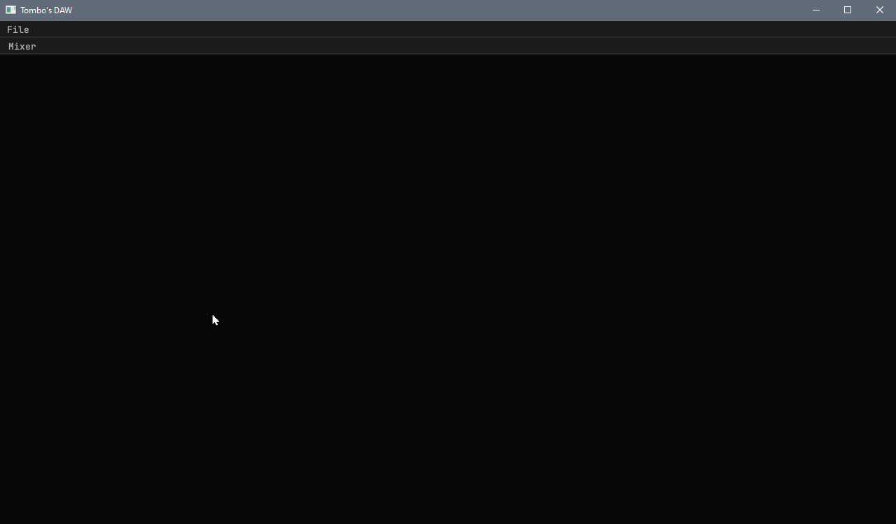

# Development Progress

## 2023-02-10

Set up a project with egui and followed several examples to create a basic
windowing system with a mixer view. The mixer view contains audio channels with
their name, volume, panning, and mute status, all of which are editable.

Currently, the mixer channels' state are completely separate from the Project,
as they are stored in a Box inside the Windows struct. I still don't know what
the project's state management should look like. Really, I should be focusing on
making some noises rather than the GUI!

Next time:
* Generate audio of some kind, running alongside the GUI
  * Explore the possibility of using ASIO for low latency audio
* Pay closer attention to the data structures required to store a music project,
  including all its MIDI and audio data.
